# RaceHub 🏁

RaceHub is a Formula 1 companion app for **Android** and **iOS**. It shows the race calendar, driver and constructor standings, and a circuit guide for each Grand Prix. It also has a community forum where fans can start threads, comment, and like posts.

The app is built with **Kotlin Multiplatform (KMP)**. All business logic, networking, persistence, and session handling live in one shared Kotlin module. Each platform has its own native UI: **Jetpack Compose** on Android and **SwiftUI** on iOS.

---

## Screenshots

### Android

|                        Race (light)                        |                           Race (dark)                           |                              Race detail                               |                            Full calendar                            |
|:----------------------------------------------------------:|:---------------------------------------------------------------:|:----------------------------------------------------------------------:|:-------------------------------------------------------------------:|
| 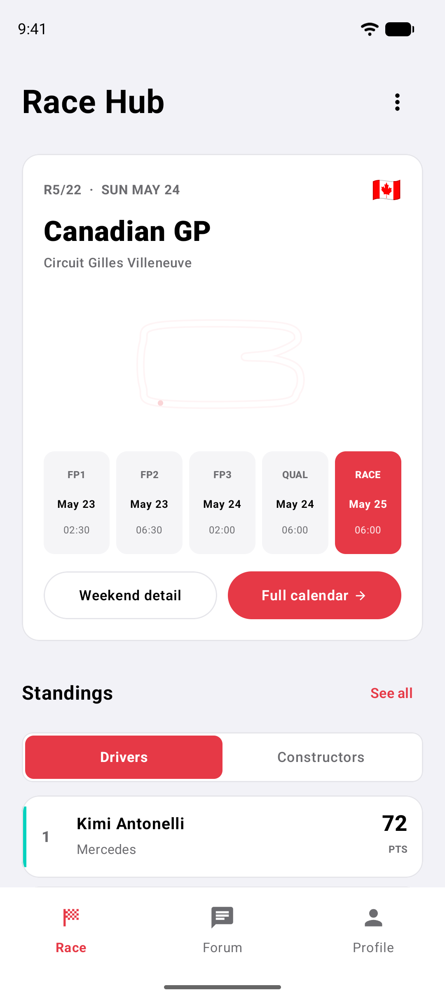 | 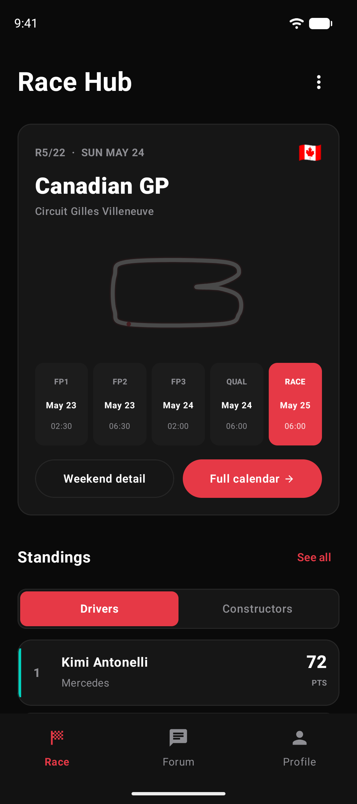 | 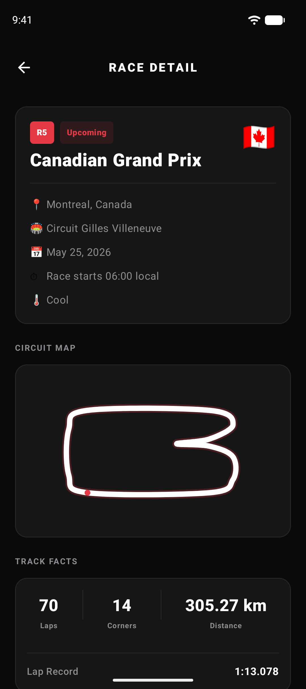 | 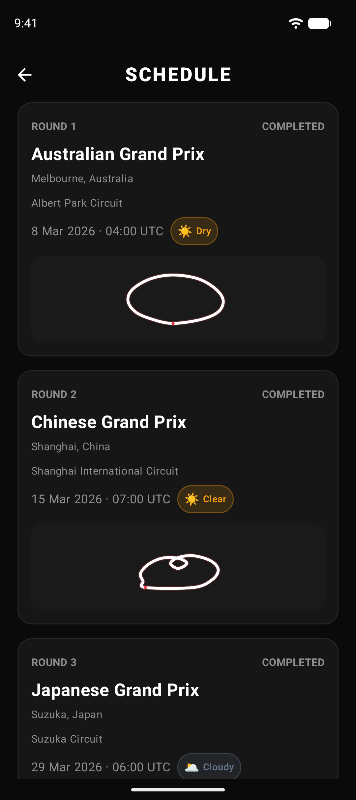 |

|                            Forum                            |                              Thread detail                               |                        Profile (light)                        |                           Profile (dark)                           |
|:-----------------------------------------------------------:|:------------------------------------------------------------------------:|:-------------------------------------------------------------:|:------------------------------------------------------------------:|
| 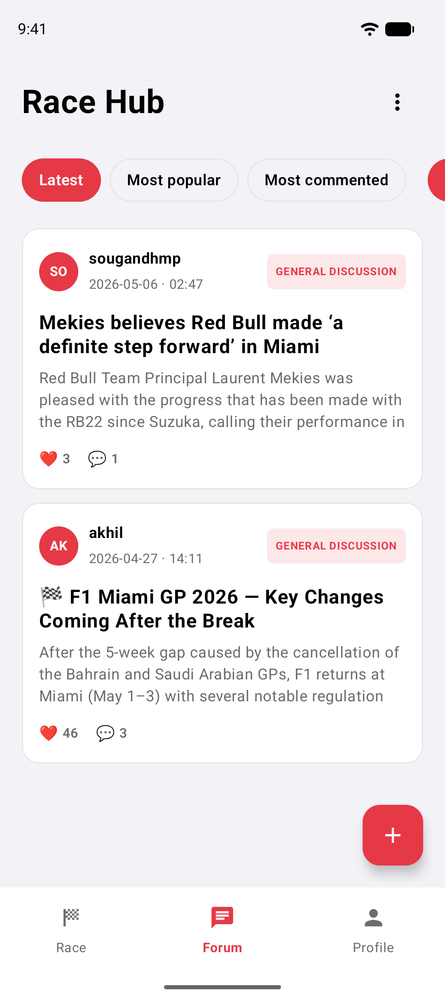 | 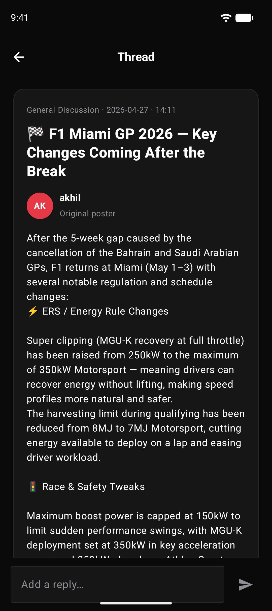 | 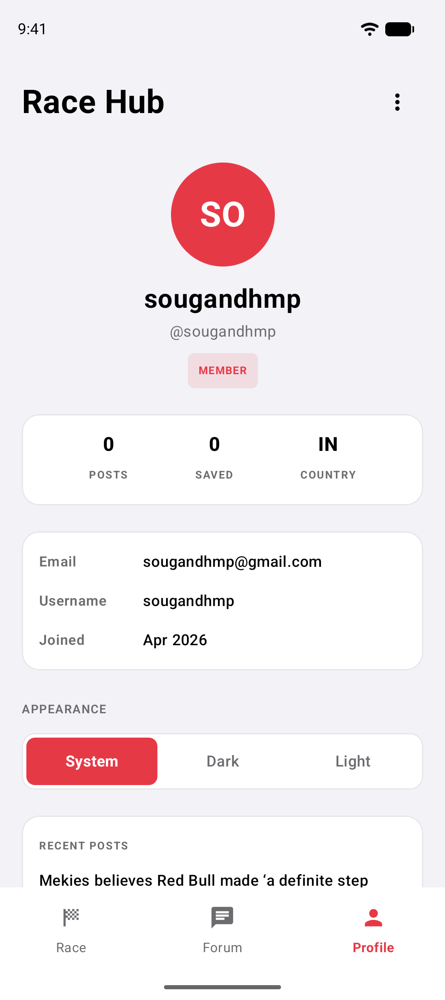 | 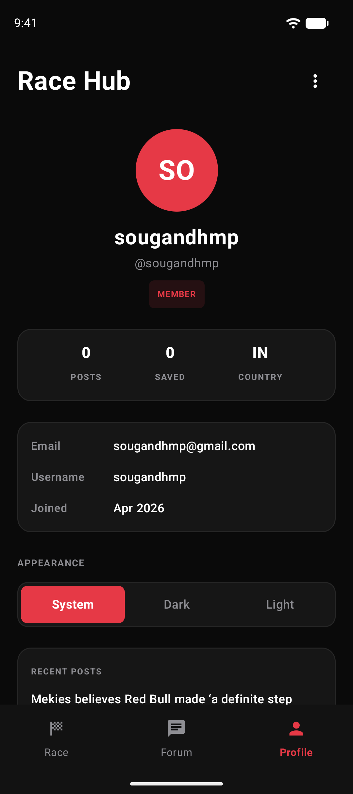 |

<sub>Taken on the Android build (Pixel emulator).</sub>

### iOS

|                          Login                          |                          Sign up                         |
|:-------------------------------------------------------:|:--------------------------------------------------------:|
| 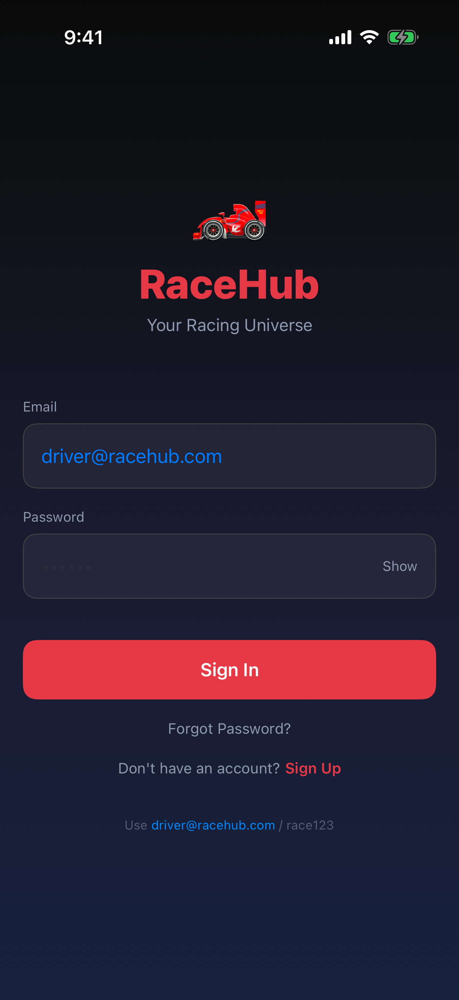 | 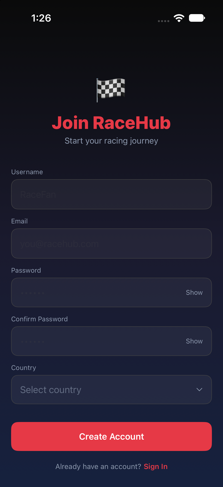 |

|                      Race (light)                      |                         Race (dark)                         |                            Race detail                             |                          Full calendar                          |
|:------------------------------------------------------:|:-----------------------------------------------------------:|:------------------------------------------------------------------:|:---------------------------------------------------------------:|
| 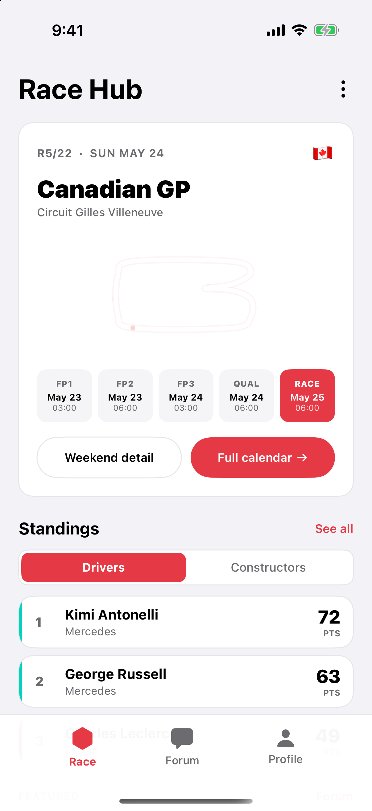 | 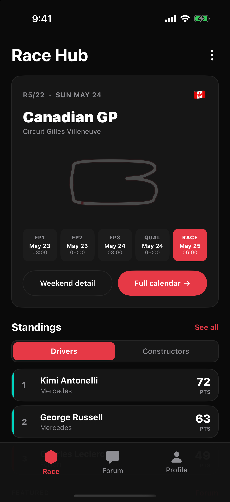 | 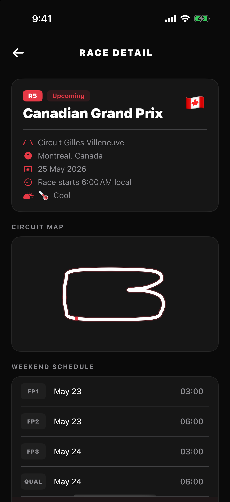 | 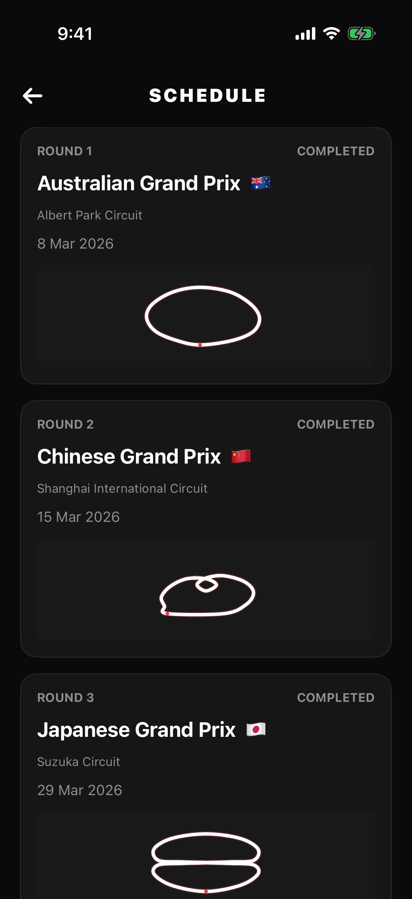 |

|                          Forum                          |                            Thread detail                             |                      Profile (light)                      |                         Profile (dark)                         |
|:-------------------------------------------------------:|:--------------------------------------------------------------------:|:---------------------------------------------------------:|:--------------------------------------------------------------:|
| 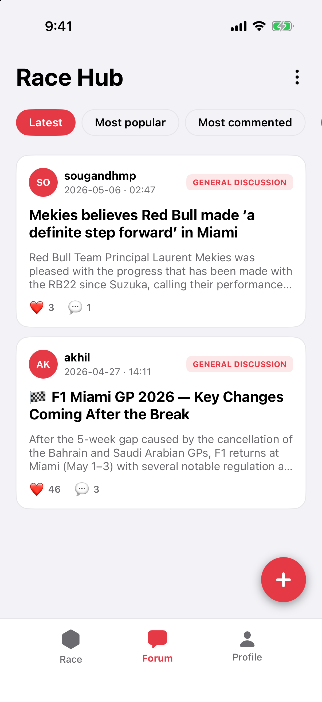 | 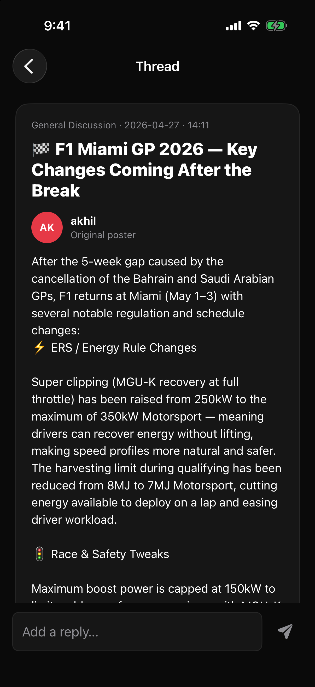 | 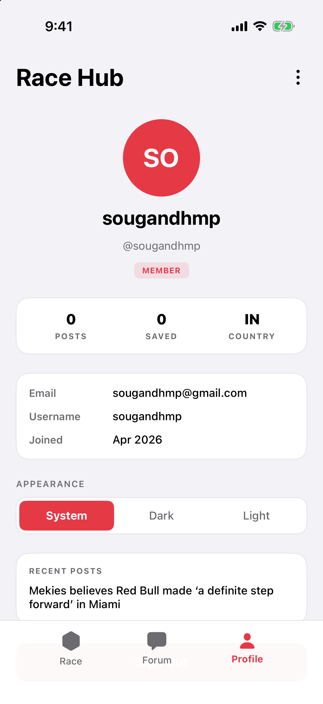 | 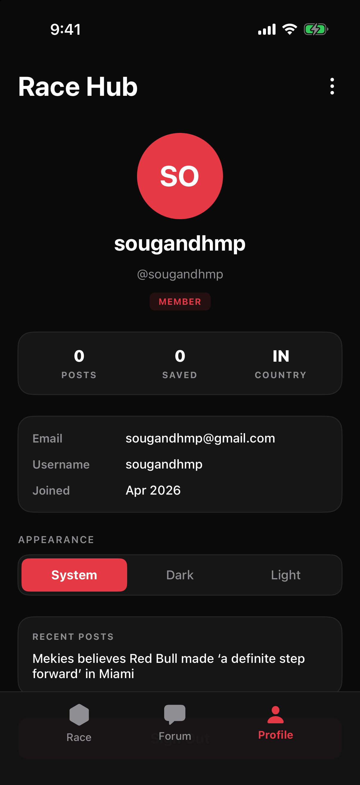 |

<sub>Taken on the SwiftUI build (iPhone 17 Pro simulator).</sub>

---

## Features

### Authentication
- **Sign in** with email and password. The session token is stored **encrypted at rest** (AES-256 `EncryptedSharedPreferences` on Android, the Keychain on iOS), so users stay signed in across launches.
- **Sign up** with username, email, password, and country (the country picker lists every ISO country).
- **Email verification by OTP.** After sign-up, a one-time code is emailed to the user, who verifies it in the app. Codes can be resent.
- **Forgot password.** Request a reset OTP, then set a new password with it.
- **Sign out** clears the session on the server and on the device.

### Race
- **Next race card** with the round, date, country flag, circuit outline, and the full weekend timetable (FP1, FP2, FP3, Qualifying, Race).
- **Standings** with a Drivers / Constructors toggle, team colour accents, and points.
- **Full calendar** for the season with each race's status, date, weather, and circuit map.
- **Race detail** with location, circuit, local start time, weather, a large circuit map, and track facts (laps, corners, distance, lap record).
- **Offline cache.** Races, standings, and trending threads are saved in a local SQLDelight database. If the network is down, the app shows the last data it cached.

### Forum
- Thread feed with **Latest**, **Most popular**, and **Most commented** filters.
- **Create threads** in categories such as General Discussion.
- **Thread detail** with the full post, likes, replies, and an inline reply box.

### Profile & settings
- Profile header with avatar initials, role badge, and stats (posts, saved, country).
- Account details (email, username, join date).
- Recent and saved posts.
- **Appearance**: choose **System**, **Dark**, or **Light** theme. The choice is kept across launches.

---

## Architecture

RaceHub follows **Clean Architecture**, with the **MVI** (Model-View-Intent) pattern in the presentation layer.

```
┌─────────────────────────────┐   ┌─────────────────────────────┐
│  composeApp (Android)       │   │  iosApp (iOS)               │
│  Jetpack Compose + MVI      │   │  SwiftUI + MVI              │
│  State / Intent / Effect    │   │  State / Intent / Effect    │
│  ViewModel (Koin-injected)  │   │  ObservableObject VM        │
└──────────────┬──────────────┘   └──────────────┬──────────────┘
               │     uses cases & models         │  Shared.xcframework
               ▼                                 ▼
┌──────────────────────────────────────────────────────────────┐
│  shared (Kotlin Multiplatform)                               │
│                                                              │
│  domain   ─ models, repository interfaces, use cases         │
│  data     ─ Ktor GraphQL client, DTOs + mappers,             │
│             repository impls, SQLDelight cache,              │
│             session storage (expect/actual)                  │
│  di       ─ Koin modules + dependency providers for Swift    │
└──────────────────────────────────────────────────────────────┘
```

**How MVI works here.** Every screen has an immutable `State`, a sealed set of `Intent`s (user actions), and one-off `Effect`s (navigation, toasts). The ViewModel takes intents, calls use cases from `shared`, and emits a new state. Both platforms use the same contract shape, so a feature looks the same whether you open the Kotlin or the Swift version.

**Error handling.** Repositories are the error boundary. Network and parsing failures are caught there and turned into domain results (for example `AuthResult` or `EmailVerificationResult`), so the UI never sees raw exceptions.

**Platform-specific code** goes through `expect`/`actual`:

| Concern         | Android                                       | iOS                                      |
|-----------------|-----------------------------------------------|------------------------------------------|
| HTTP engine     | OkHttp                                        | Darwin (NSURLSession)                    |
| SQLite driver   | `AndroidSqliteDriver`                         | `NativeSqliteDriver`                     |
| Session storage | `EncryptedSharedPreferences`                  | Keychain                                 |
| DI bootstrap    | `KoinInitializer.setApplication()` + `init()` | `KoinInitializer.shared.start(baseUrl:)` |

---

## Tech stack

| Area                 | Library                                                   |
|----------------------|-----------------------------------------------------------|
| Language             | Kotlin 2.3 (Multiplatform), Swift                         |
| Android UI           | Jetpack Compose, Material 3, Compose Resources            |
| iOS UI               | SwiftUI                                                   |
| Networking           | Ktor client 3 + kotlinx.serialization (GraphQL over HTTP) |
| Persistence          | SQLDelight 2                                              |
| Dependency injection | Koin 4                                                    |
| Concurrency          | Kotlin Coroutines & Flow                                  |
| Secure storage       | AndroidX Security Crypto                                  |
| Testing / coverage   | kotlin-test, kotlinx-coroutines-test, Kover               |
| Build                | Gradle (Kotlin DSL), version catalog, AGP 9               |

Android `minSdk 24`, `targetSdk 37`. iOS deployment target 18.2.

---

## Project structure

```
RaceHub/
├── composeApp/                     # Android app (Jetpack Compose)
│   └── src/androidMain/kotlin/org/gce/racehub/
│       ├── login/  signup/  emailverification/  forgotpassword/
│       ├── home/                   # Tab host, schedule, standings, create thread
│       ├── race/                   # Race tab, race detail, circuit drawings
│       ├── forum/                  # Forum feed, thread detail
│       ├── profile/
│       ├── theme/                  # AppColors, Dimens, ThemeManager
│       ├── di/AppModule.kt         # Android ViewModels
│       └── App.kt                  # Theme + navigation root
│
├── iosApp/                         # iOS app (SwiftUI), mirrors composeApp features
│   └── iosApp/{Login,SignUp,ForgotPassword,Home,Race,Forum,Profile,Theme}/
│
├── shared/                         # Kotlin Multiplatform module
│   └── src/
│       ├── commonMain/kotlin/org/gce/racehub/
│       │   ├── auth/{domain,data,di}/     # Login, sign-up, OTP, password reset, session
│       │   ├── race/{domain,data,di}/     # Races, standings, forum, profile
│       │   ├── db/                        # SQLDelight local data source
│       │   └── util/                      # Dispatchers, Logger
│       ├── commonMain/sqldelight/         # RaceHubDatabase.sq
│       ├── androidMain/ · iosMain/        # expect/actual implementations
│       └── commonTest/                    # Use case, mapper and session tests + fakes
│
└── docs/screenshots/
```

---

## Getting started

### Prerequisites
- **JDK 21** (Xcode's build phase uses `openjdk@21` from Homebrew)
- **Android Studio** (latest stable) with Android SDK 37
- **Xcode** 26+ for the iOS app (macOS only)

### Backend
The app talks to a GraphQL API. The base URL is set when Koin starts:

- Android: `composeApp/src/androidMain/kotlin/org/gce/racehub/RaceHubApplication.kt`
- iOS: `iosApp/iosApp/iOSApp.swift`

Change it there to point at your own backend.

### Run on Android
From the IDE, pick the `composeApp` run configuration. Or use the terminal:

```shell
./gradlew :composeApp:installDebug     # build and install on a connected device/emulator
```

### Run on iOS
Open `iosApp/iosApp.xcodeproj` in Xcode and run the `iosApp` scheme. A build phase runs `./gradlew :shared:embedAndSignAppleFrameworkForXcode`, which compiles the shared Kotlin code into the `Shared` framework for you.

---

## Testing

The shared module has unit tests for every use case, the DTO mappers, and `UserSession`. The tests use fake repositories, so they don't need a network or a device.

```shell
./gradlew :shared:testDebugUnitTest          # run shared tests on the JVM
./gradlew :shared:iosSimulatorArm64Test      # run the same tests on the iOS simulator
./gradlew :shared:koverHtmlReport            # coverage report → shared/build/reports/kover/html
```

The Kover report leaves out network clients, generated SQLDelight code, DI wiring, and DTOs, so the coverage number reflects the domain logic.

---

## Adding a feature

1. **Domain**: add the model, a repository method, and a use case in `shared/src/commonMain/.../domain`.
2. **Data**: implement the repository method (DTO, mapper, network call, cache) in `.../data`.
3. **DI**: register the use case in the feature's Koin module. For iOS, also expose it through the matching `*DependencyProvider`.
4. **UI**: on each platform, create `State`, `Intent`, `Effect`, a ViewModel, and the screen.
5. **Tests**: add a use case test in `shared/src/commonTest`, using the fakes in `fake/`.
